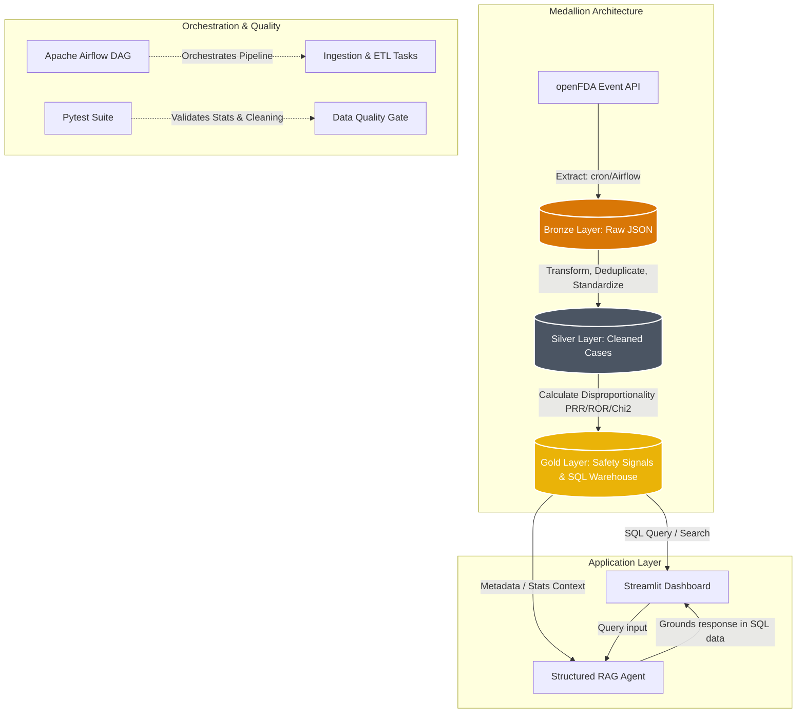

# FAERSight: Pharmacovigilance Signal Intelligence Pipeline
[](https://github.com/yourusername/pharma-drug-safety-pipeline/actions)
[](https://www.python.org/)
[](https://www.postgresql.org/)
[](https://streamlit.io/)
[](https://github.com/astral-sh/ruff)

An end-to-end data engineering and pharmacovigilance analytics pipeline designed to detect statistically significant adverse-drug-reaction signals from the FDA Adverse Event Reporting System (FAERS). 

Built using a **Medallion Data Lakehouse Architecture (Bronze ➔ Silver ➔ Gold)**, it flattens raw openFDA JSON events, executes high-performance vectorized statistical analysis (PRR, ROR, Yates' $\chi^2$), maps relational records to SQLite/PostgreSQL, and presents findings in a Streamlit dashboard powered by a **Structured RAG (Grounded Database Retrieval)** safety chatbot.

---

## 🏗️ Architecture Overview



### Key Engineering & Domain Differentiators
1. **Medallion Data Architecture**: Organizes messy public data stages into isolated zones: Bronze (raw JSON data), Silver (deduplicated patient cases and standardized drug ingredients), and Gold (pre-aggregated statistical metrics loaded into indexes).
2. **Quality Gates & Case Deduplication**: FAERS reports contain multiple updates for the same medical case. The Silver stage implements deduplication by retaining only the highest `caseversion` per unique `caseid` and filters incomplete records.
3. **Fuzzy Drug Synonym Standardization**: Resolves raw, misspelled, and free-text brand names (e.g. *Humira Pen 40mg*, *Adalimumab-adaz*, *adalimumab*) into their standardized active generic ingredient (e.g. *adalimumab*) using an internal mapping dictionary.
4. **Structured RAG (Zero Hallucination Chatbot)**: Traditional RAG agents query unstructured text databases and struggle with mathematical accuracy. This bot resolves the drug/brand in your query, retrieves exact statistical counts and ratios directly from the Gold database, and passes them as grounded context to Gemini to guarantee mathematical truth.

---

## 📊 Pharmacovigilance Math

For every drug-reaction combination, the pipeline constructs a $2 \times 2$ contingency table:

| | Target Adverse Event | All Other Adverse Events | Total |
| :--- | :--- | :--- | :--- |
| **Target Drug** | $a$ (Co-occurrence) | $b$ (Drug, No Event) | $a + b$ ($N_{drug}$) |
| **All Other Drugs** | $c$ (No Drug, Event) | $d$ (Neither) | $c + d$ ($N_{other\_drugs}$) |
| **Total** | $a + c$ ($N_{event}$) | $b + d$ ($N_{other\_events}$) | $N$ (Total Reports) |

### Calculations
*   **Proportional Reporting Ratio (PRR)**: Indicates how frequently an event is reported for the drug compared to the rest of the database.
    $$PRR = \frac{a / (a + b)}{c / (c + d)}$$
*   **Reporting Odds Ratio (ROR)**: Odds of an adverse event occurring with the target drug vs other drugs.
    $$ROR = \frac{a \times d}{b \times c}$$
*   **Standard Error of $\ln(ROR)$ & 95% Confidence Intervals (CI)**:
    $$SE(\ln(ROR)) = \sqrt{\frac{1}{a} + \frac{1}{b} + \frac{1}{c} + \frac{1}{d}}$$
    $$CI_{95\%} = \left[ e^{\ln(ROR) - 1.96 \cdot SE}, \ e^{\ln(ROR) + 1.96 \cdot SE} \right]$$
*   **Yates' Corrected Chi-Square ($\chi^2$)**: Evaluates statistical significance by adjusting for small cell sizes.
    $$\chi^2_{Yates} = \frac{N \left(|a d - b c| - \frac{N}{2}\right)^2}{(a+b)(c+d)(a+c)(b+d)}$$

### Signal Threshold (MHRA standard)
A drug-reaction association is flagged as an active **Safety Signal** if:
1.  Number of cases is $a \ge 3$.
2.  Strength of reporting ratio is $PRR \ge 2.0$.
3.  Statistical significance score is $\chi^2_{Yates} \ge 3.84$ ($p < 0.05$ with 1 degree of freedom).

---

## 📂 Project Directory Structure

```text
pharma-drug-safety-pipeline/
├── .github/workflows/ci-cd.yml # GitHub Actions: Ruff linter & Pytest suite
├── dags/safety_pipeline_dag.py # Airflow DAG orchestrating Medallion pipeline
├── data/                       # Medallion data directory (git-ignored)
│   ├── bronze/                 # Raw JSON payloads
│   ├── silver/                 # Normalized, cleaned CSVs
│   └── gold/                   # Aggregated signals & safety_signals.db (SQLite)
├── docker/
│   ├── Dockerfile              # App and Airflow container definition
│   └── docker-compose.yml      # Containerized PostgreSQL and Streamlit app
├── src/
│   ├── config.py               # Handles environment variables and monitored drug list
│   ├── pipeline/               # Ingestion, cleaning, and statistics scripts
│   ├── app/                    # Streamlit dashboard, Plotly charts, and RAG agent
│   └── utils/                  # DB connection managers and synonym dictionaries
├── tests/                      # Pytest unit tests for ETL and statistics
└── run_pipeline.py            # Unified runner to trigger ETL steps
```

---

## 🚀 Getting Started

### 1. Installation
Clone the repository and install the dependencies:
```bash
git clone https://github.com/yourusername/pharma-drug-safety-pipeline.git
cd pharma-drug-safety-pipeline
python -m venv venv
source venv/bin/activate  # On Windows: venv\Scripts\activate
pip install -r requirements.txt
```

### 2. Configuration
Create a `.env` file from the template:
```bash
cp .env.template .env
```
Open `.env` and add your API keys:
```ini
OPENFDA_API_KEY=your_key_here  # Optional: speeds up queries
GEMINI_API_KEY=your_key_here  # Required for RAG Q&A
```
*(Note: If no API key is specified, the ingestion script automatically generates simulated FAERS records so you can run the pipeline immediately.)*

### 3. Execution
Run the entire pipeline (Bronze ➔ Silver ➔ Gold ➔ SQL Load):
```bash
python run_pipeline.py
```

Run unit tests to verify logic:
```bash
python -m pytest tests/
```

Start the Streamlit dashboard:
```bash
streamlit run src/app/app.py
```

---

## 🐳 Docker Deployment (PostgreSQL Backend)

The project includes a multi-container Docker compose environment that launches a PostgreSQL database alongside the Streamlit app.

To run:
```bash
cd docker
docker-compose up --build
```
Access the dashboard at `http://localhost:8501`. Data will automatically be written to the Docker-hosted PostgreSQL server instead of local SQLite.

---

## 🔗 Airflow Orchestration
To deploy the pipeline scheduler, place the contents of `dags/` into your Airflow DAGs directory. The DAG exposes a clean three-task pipeline: `ingest_bronze >> clean_silver >> analyze_gold` scheduled to run weekly.
